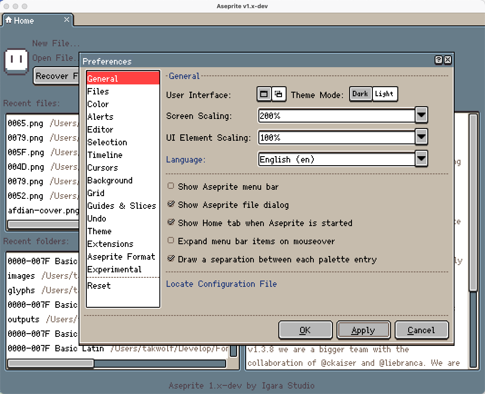
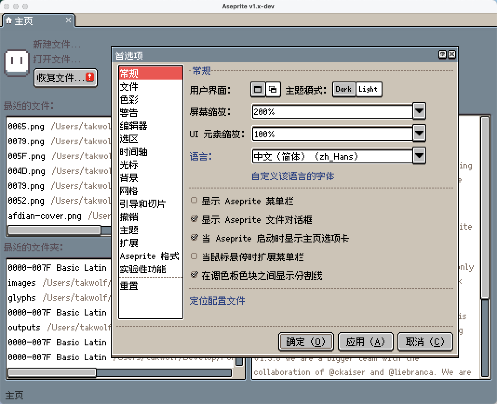
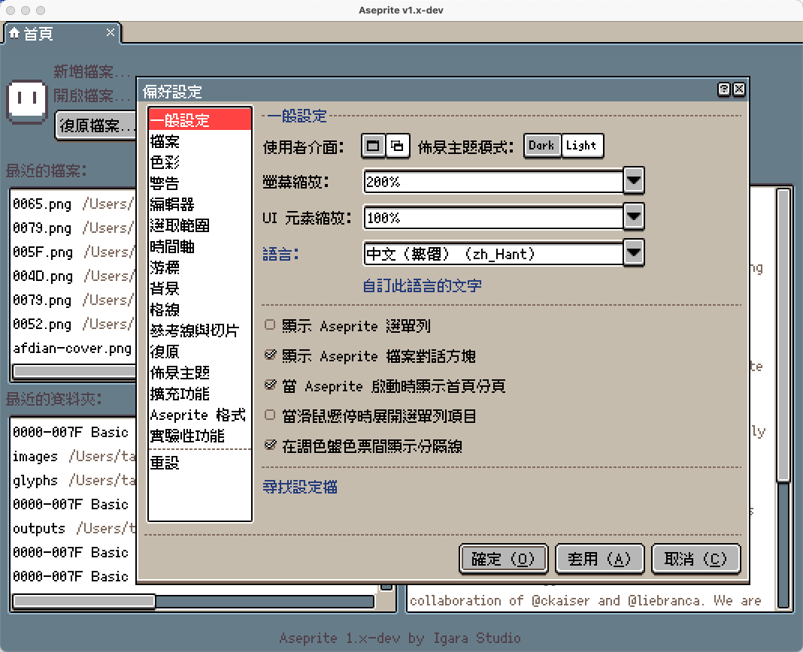
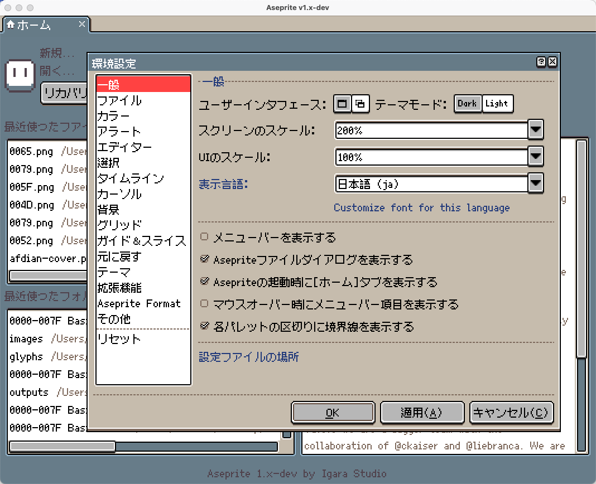
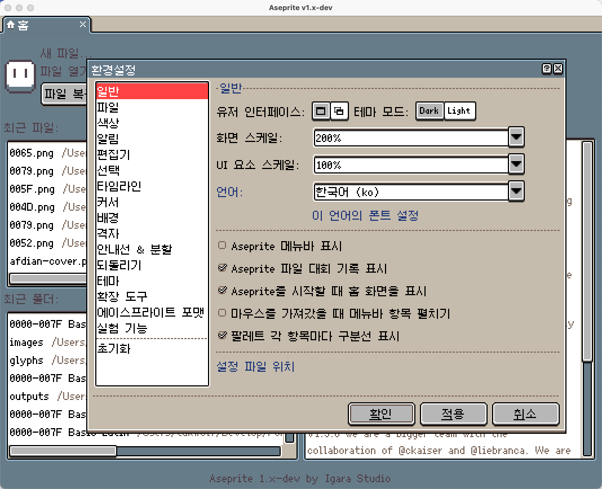
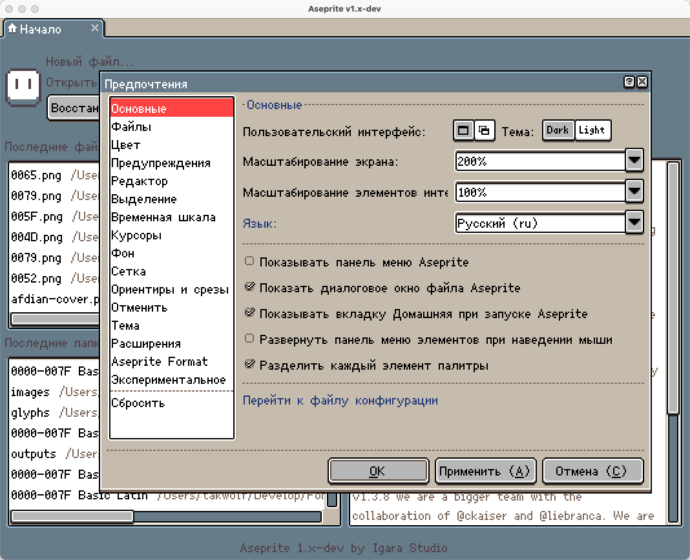
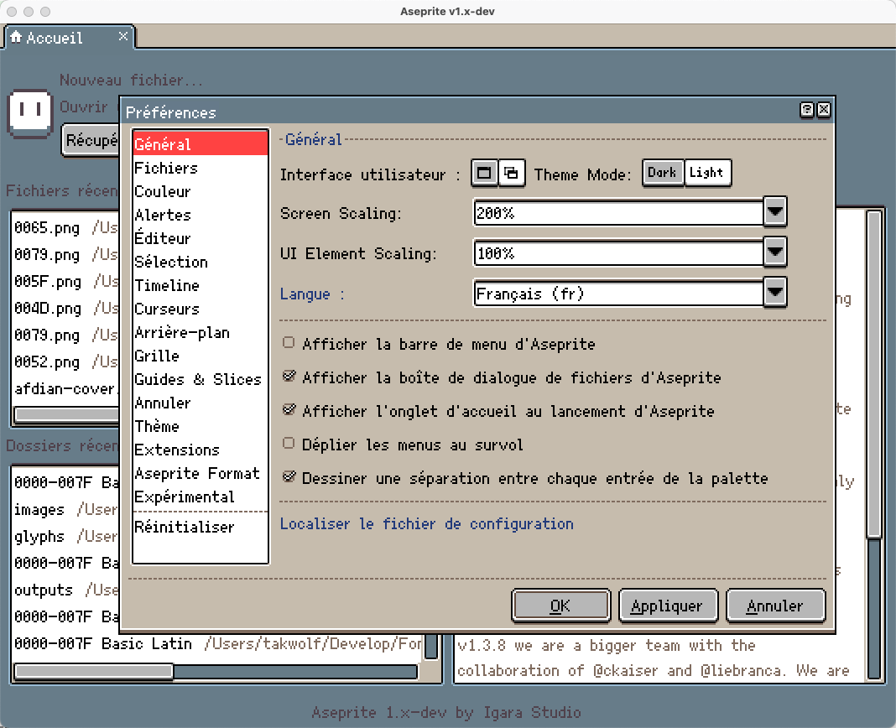
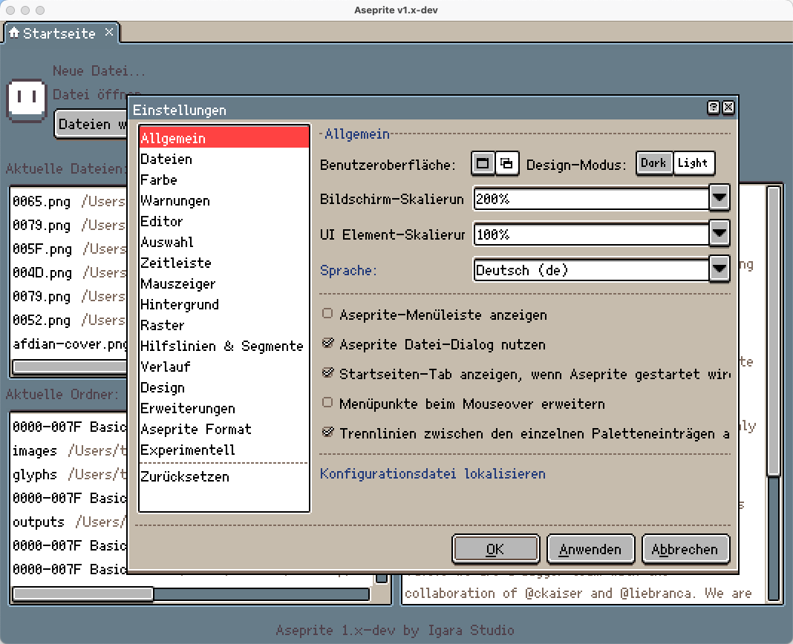
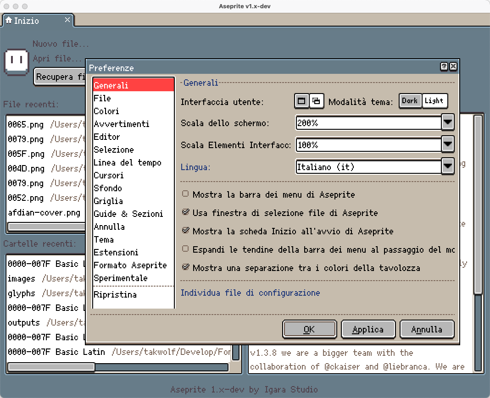
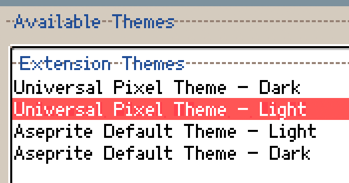

# Aseprite 泛用多语言像素主题

支持多语言的具有默认主题外观的像素主题。

## 概述

[Aseprite](https://github.com/aseprite/aseprite) 默认主题支持的字符相当有限，基本上仅覆盖基础西文字母，对东亚字符显示糟糕。

因此，我们尝试基于 [默认主题](https://github.com/aseprite/aseprite/tree/main/data/extensions/aseprite-theme) 进行改造，在尽可能保留原始主题外观的情况下，使其支持多语言字符显示。

## 预览

以下仅列出经过测试的语言。

其他语言虽未列出，但有可能也受到支持。

### 英文

### 中文（简体）

### 中文（繁体）

### 日语

### 韩语

### 俄语

### 法语

### 德语

### 意大利语

## 安装

主题的安装方法请参考官方文档：[Aseprite Extensions](https://aseprite.org/docs/extensions/)

安装完成后，请选择下面两个主题：

- Universal Pixel Theme - Light
- Universal Pixel Theme - Dark

## 许可证

[CC BY 4.0](LICENSE)
